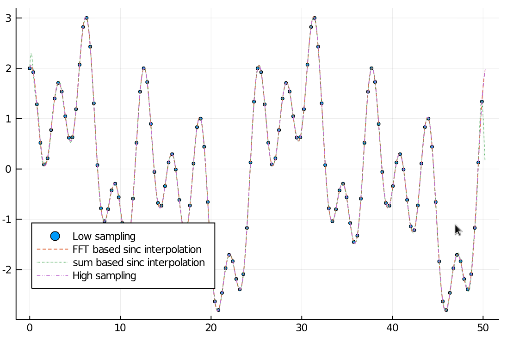

# FFTResampling.jl


This package provides a simple sinc interpolation routine (up and downsampling) written in Julia.
It works with real and complex N-dimensional arrays.

**As this package is at an early stage of development, we would be excited to welcome any new contributers!**

| **Documentation**                       | **Build Status**                          | **Code Coverage**               |
|:---------------------------------------:|:-----------------------------------------:|:-------------------------------:|
| [![][docs-stable-img]][docs-stable-url] [![][docs-dev-img]][docs-dev-url] | [![][CI-img]][CI-url] | [![][codecov-img]][codecov-url] |


## Installation
`FFTResampling.jl` is available for all version equal or above Julia 1.3. It is mainly tested in Linux but should also work in Windows.
It can be installed with the following command

```julia
julia> ] add FFTResampling
```

## Functionality
The FFTW based methods require periodic, bandwidth limited (and properly Nyquist sampled) signals.
Currently the algorithms work only with equidistant spaced signals. We offer two main methods: `sinc_interpolate` and `downsample`.
The first one upsamples a signal by zero padding in Fourier space.
The second one downsamples a signal by cropping frequencies around the center spot. We therefore reduce resolution without aliasing. 


## Example

### Sinc interpolation
Below you can find a simple example for `sinc_interpolate` and `sinc_interpolate_sum`.
Furthermore, there is an image interpolation Pluto.jl notebook in the [examples folder](examples/).
We can see that the interpolated signal matches the higher sampled signal well.
```julia
 begin
	N_low = 128
	x_min = 0.0
	x_max = 16π
	
	xs_low = range(x_min, x_max, length=N_low+1)[1:N_low]
	xs_high = range(x_min, x_max, length=5000)[1:end-1]
	f(x) = sin(0.5*x) + cos(x) + cos(2 * x) + sin(0.25*x)
	arr_low = f.(xs_low)
	arr_high = f.(xs_high)
end

begin
	N = 1000
	xs_interp = range(x_min, x_max, length=N+1)[1:N]
	arr_interp = sinc_interpolate(arr_low, N)

	N2 = 1000
	xs_interp_s = range(x_min, x_max, length=N2+1)[1:N2]
	arr_interp_s = FFTResampling.sinc_interpolate_sum(arr_low, N2)
end

begin
	scatter(xs_low, arr_low, legend=:bottomleft, markersize=2, label="Low sampling")
	plot!(xs_interp, arr_interp, label="FFT based sinc interpolation", linestyle=:dash)
	plot!(xs_interp_s, arr_interp_s, label="sum based sinc interpolation", linestyle=:dot)
	plot!(xs_high, arr_high, linestyle=:dashdotdot, label="High sampling")
end
```



### Downsampling
32 samples in the downsampled signal should be sufficient for Nyquist sampling.
And as we can see, the downsampled signal still matches the original one.

```julia
begin
	N_ds = 32
	xs_ds = range(x_min, x_max, length=N_ds+1)[1:N_ds]
	arr_ds = FFTResampling.downsample(arr_high, N_ds)
end

begin
	scatter(xs_low, arr_low, legend=:bottomleft, markersize=2, label="Low sampling")
	plot!(xs_interp, arr_interp, label="FFT based sinc interpolation", linestyle=:dash)
	plot!(xs_ds, arr_ds, label="downsampled array", linestyle=:dot)	
end
```


[docs-dev-img]: https://img.shields.io/badge/docs-dev-pink.svg 
[docs-dev-url]: https://roflmaostc.github.io/FFTResampling.jl/dev/ 

[docs-stable-img]: https://img.shields.io/badge/docs-stable-darkgreen.svg 
[docs-stable-url]: https://roflmaostc.github.io/FFTResampling.jl/stable/

[CI-img]: https://github.com/roflmaostc/FFTResampling.jl/workflows/CI/badge.svg
[CI-url]: https://github.com/roflmaostc/FFTResampling.jl/actions?query=workflow%3ACI 

[codecov-img]: https://codecov.io/gh/roflmaostc/FFTResampling.jl/branch/main/graph/badge.svg
[codecov-url]: https://codecov.io/gh/roflmaostc/FFTResampling.jl
